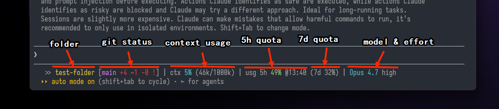
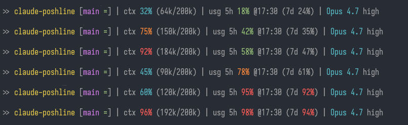
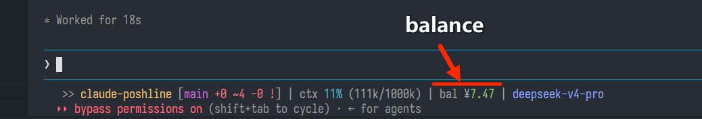

# claude-poshline

A posh-git–style status line for [Claude Code](https://claude.com/claude-code) — git status, context usage, quota, and model — with width-aware auto-wrap.

[中文版 / Chinese version](./README.zh-CN.md)



## What it shows

From left to right:

- **`>> <folder> [<branch> <status>]`** — posh-git–style git segment:
  - `+a ~m -d` change counts (green = staged, red = working tree)
  - `^N` / `vN` ahead / behind the remote
  - trailing flag: `!` dirty, `~` staged only, `=` clean & synced
  - `[no git]` when not in a repo
- **`ctx <used>% (Nk/Mk)`** — conversation context usage
- **`usg 5h <used>% @<reset-clock> (7d <used>%)`** — Claude rate-limit quota *(hidden for DeepSeek — see below)*
- **`<model> <effort>`** — current model and effort level *(effort hidden for DeepSeek; model shown in `#96a6f6`)*

Percentages change color by value:

- `ctx` and `usg 5h`: green `<70` → amber `≥70` → red `≥90`
- `usg 7d`: gray `<90` → red `≥90`



## DeepSeek support

When Claude Code uses a DeepSeek API, the status line adapts automatically — no config needed. Detection is by the `display_name` field in the session JSON (case-insensitive match on `"deepseek"`).

Two access modes are supported, **detected automatically**:

| Mode | Detection | API key source |
|---|---|---|
| **Direct** | `ANTHROPIC_BASE_URL` points to `https://api.deepseek.com/...` | `ANTHROPIC_AUTH_TOKEN` env var |
| **claude-code-router proxy** | `ANTHROPIC_BASE_URL` points to `127.0.0.1` / `localhost` | Read automatically from CCR's `gateway.config.json` |

The script **never stores** any API key — keys remain only in your CCR config or environment.



### What changes

| Segment | Claude native | DeepSeek |
|---|---|---|
| **usg (quota)** | 5h rolling + 7d usage | **hidden** — Anthropic's rate-limit model doesn't apply to DeepSeek's pay-per-token billing |
| **effort level** | shown after model name | **hidden** — DeepSeek maps effort differently (low/medium→high, xhigh→max) |
| **model color** | cyan | `#96a6f6` (soft blue-purple) for visual distinction |
| **context window** | read from JSON as-is | **corrected**: DeepSeek models default to **1M** tokens; `deepseek-v4-flash` is **200K**. Percentage recalculated against the real window |
| **balance** | (not shown) | `bal ¥<amount>` queried from DeepSeek's `/user/balance` API with a **5-minute cache** |

### How balance works

- **Direct mode**: reads `ANTHROPIC_AUTH_TOKEN` from the environment (set by ccswitch or Claude Code's `settings.json` `env` block).
- **CCR mode**: reads the real DeepSeek API key from `%APPDATA%/claude-code-router/gateway.config.json` automatically — no manual setup.
- The API key is **never** written into the script — only read at runtime.
- Cache file at `~/.claude/.poshline-balance`. Fresh for 5 minutes — during that window the status bar renders instantly.
- When the cache expires: the **stale value** is still shown while a background `curl` refreshes it asynchronously. No blocking.
- A lock file prevents concurrent refresh requests.

## Auto width-aware wrapping

When the terminal is too narrow to fit the whole bar on one line, it wraps **by segment** (folder/git, `ctx`, `usg`, model) — each segment stays whole, nothing gets truncated mid-word.

Requires Claude Code **v2.1.153+** (which injects `$COLUMNS`). On older versions the script falls back to an 80-column assumption.

## Dependencies

- **Bash version (`statusline.sh`)** — `bash` + `git`. That's it. No `posh-git`, no `jq`, no `python`. On Windows, install [Git for Windows](https://git-scm.com/download/win) (it ships Git Bash).
- **PowerShell version (`statusline.ps1`)** — `pwsh` (PowerShell 7+) + `git`.

> The name "poshline" only refers to the **visual style** of [posh-git](https://github.com/dahlbyk/posh-git). The script reimplements the look — posh-git itself is not required.

## Customize it

It's just one script — once it's running, ask Claude Code to change whatever you don't like. For example:

- *"Change the amber threshold from 70% to 80%."*
- *"Make the branch name bold cyan instead of magenta."*
- *"Drop the `(7d X%)` part, I only care about the 5-hour window."*
- *"Add the current time at the very end of the bar."*
- *"Show the python venv name when I'm inside one."*

Point Claude at `~/.claude/statusline.sh` (or `.ps1`) and describe what you want — it'll edit in place.

## Install

**Recommended: ask Claude Code to do it.** Open Claude Code in any directory and paste:

```
Install claude-poshline from https://github.com/huangko555/claude-poshline for me.
Follow the "Instructions for Claude" section in its README.
```

Claude will pick the right script for your OS, drop it into `~/.claude/`, and merge the `statusLine` block into your `settings.json` without touching anything else.

### Instructions for Claude

*(This section is addressed to Claude Code when a user asks you to install claude-poshline. Read the rest of the README first for context, then follow these steps.)*

1. **Pick the script.** On Windows, default to the **Bash version** (`statusline.sh`) — the PowerShell version breaks on non-ASCII paths on Chinese Windows. Only use `statusline.ps1` if the user explicitly asks for it or has no Git Bash. On macOS / Linux, use the Bash version.
2. **Fetch and place the script.** Download the chosen script from this repo's raw URL and write it to `~/.claude/statusline.sh` (or `.ps1`). For the Bash version, ensure **LF** line endings (not CRLF) and that the file is executable.
3. **Merge `~/.claude/settings.local.json`** (NOT `settings.json` — `/model` and `/theme` slash commands overwrite `settings.json` and will drop the `statusLine` key). Use `settings.local.json` instead; Claude Code merges both files. If the file exists, read it, add the `statusLine` block below as a top-level key, preserve every other key, then write valid JSON back. If it doesn't exist, create it with just this block. Substitute the user's actual username in the path:
   - Bash: `"command": "bash /c/Users/<USER>/.claude/statusline.sh"` (on macOS/Linux use the native path)
   - PowerShell: `"command": "pwsh -NoProfile -ExecutionPolicy Bypass -File C:/Users/<USER>/.claude/statusline.ps1"`
   - Both blocks also need `"type": "command"`, `"padding": 1`, `"refreshInterval": 5`.
4. **(Optional) bonus theme.** Ask the user whether they want the matching theme. If yes, copy `themes/claude-fresh-blue.json` to `~/.claude/themes/claude-fresh-blue.json` and tell them to pick it via `/config` → Theme → `custom:claude-fresh-blue`.
5. **Tell the user to restart Claude Code** (or start a new session) so the status line takes effect.

### Manual install

<details>
<summary>If you'd rather do it yourself</summary>

1. Copy the script of your choice into `~/.claude/`:

   ```bash
   # Bash version (recommended on Windows for non-ASCII paths)
   cp statusline.sh ~/.claude/statusline.sh

   # or PowerShell version
   cp statusline.ps1 ~/.claude/statusline.ps1
   ```

2. Merge this into `~/.claude/settings.local.json` (create it if it doesn't exist). **Use `settings.local.json` rather than `settings.json`** — `/model` and `/theme` slash commands overwrite `settings.json` and will drop the `statusLine` key:

   **Bash version** (replace `<USER>` with your username):

   ```json
   {
     "statusLine": {
       "type": "command",
       "command": "bash /c/Users/<USER>/.claude/statusline.sh",
       "padding": 1,
       "refreshInterval": 5
     }
   }
   ```

   **PowerShell version**:

   ```json
   {
     "statusLine": {
       "type": "command",
       "command": "pwsh -NoProfile -ExecutionPolicy Bypass -File C:/Users/<USER>/.claude/statusline.ps1",
       "padding": 1,
       "refreshInterval": 5
     }
   }
   ```

3. Restart Claude Code or start a new session.

</details>

### Troubleshooting

- **Status bar disappears after `/model` or `/theme`** — those slash commands rewrite `settings.json` and drop keys they don't recognise, including `statusLine`. Put the `statusLine` block in `settings.local.json` instead — Claude Code merges both files, and local settings survive rewrites.
- **Bar is blank** — `bash` may not be on Claude Code's `PATH`. Use the full path: `"C:/Program Files/Git/bin/bash.exe" /c/Users/<USER>/.claude/statusline.sh`.
- **`statusline.sh` errors out on launch** — make sure the file uses **LF** line endings, not CRLF.
- **Chinese / non-ASCII path collapses to `[no git]` on PowerShell** — Chinese Windows defaults to code page 936, which corrupts the UTF-8 session JSON before the script runs. Use the Bash version instead — it reads stdin as raw bytes and isn't affected.
- **Balance not showing (CCR mode)** — verify that `%APPDATA%/claude-code-router/gateway.config.json` exists and contains a DeepSeek provider. The script reads the key from there automatically — no manual setup needed.

## Bonus: matching theme

`themes/claude-fresh-blue.json` is a dark theme with a fresh cyan user-message bubble (`#0E7490`) that pairs well with the status line.

Install:

```bash
mkdir -p ~/.claude/themes
cp themes/claude-fresh-blue.json ~/.claude/themes/claude-fresh-blue.json
```

Then in Claude Code: `/config` → Theme → `custom:claude-fresh-blue`.

## License

[MIT](./LICENSE)
