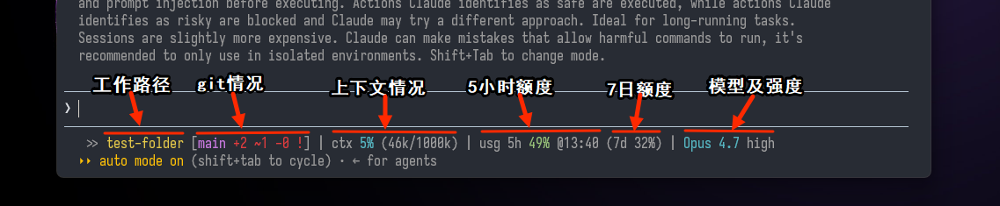
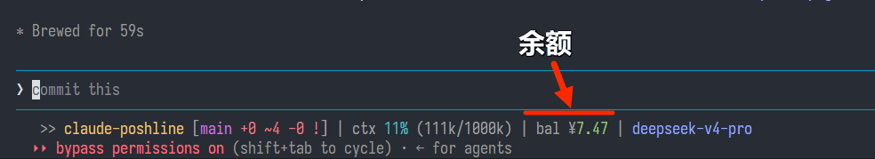

# claude-poshline

给 [Claude Code](https://claude.com/claude-code) 用的 posh-git 风格状态栏 —— git 状态、上下文用量、额度、模型，一行带走，窄窗口自动换行。

[English version](./README.md)



## 显示内容

从左到右：

- **`>> <文件夹> [<分支> <状态>]`** —— posh-git 风格的 git 段：
  - `+增 ~改 -删` 变更计数（绿=已暂存 / 红=工作区）
  - `^N` / `vN` 领先 / 落后远程
  - 尾标志：`!`=工作区脏、`~`=仅暂存、`=`=干净且同步
  - 不在 git 仓库时显示 `[no git]`
- **`ctx <已用>% (Nk/Mk)`** —— 当前会话上下文用量
- **`usg 5h <已用>% @<重置时刻> (7d <已用>%)`** —— Claude 额度用量 *（DeepSeek 下隐藏，见下文）*
- **`<模型> <effort>`** —— 当前模型和 effort 等级 *（DeepSeek 下隐藏 effort，模型用 `#96a6f6` 色）*

百分比按数值自动变色：

- `ctx` 和 `usg 5h`：绿 `<70` → 亮橙 `≥70` → 亮红 `≥90`
- `usg 7d`：灰 `<90` → 亮红 `≥90`


## DeepSeek 适配

当 Claude Code 通过 `ANTHROPIC_BASE_URL` 指向 `https://api.deepseek.com/anthropic` 接入 DeepSeek API 时，状态栏会自动识别并调整显示内容，无需额外配置。检测依据是会话 JSON 中 `display_name` 字段是否包含 `"deepseek"`（不区分大小写）。



### 显示差异

| 段位 | Claude 原生 | DeepSeek |
|---|---|---|
| **usg（额度）** | 5h 滚动窗口 + 7d 用量 | **隐藏** —— Anthropic 的额度模型对 DeepSeek 按量付费不适用 |
| **effort 等级** | 模型名后显示 | **隐藏** —— DeepSeek 映射方式不同（low/medium→high，xhigh→max），无参考意义 |
| **模型颜色** | 青色 | `#96a6f6`（柔和蓝紫），一眼区分当前用哪家 |
| **上下文窗口** | 直接读 JSON 值 | **自动修正**：DeepSeek 模型默认 **1M** tokens，`deepseek-v4-flash` 为 **200K**。百分比按真实窗口重算，不会误报 |
| **余额** | （不显示） | `bal ¥<金额>`，调用 DeepSeek `/user/balance` 接口查询，**5 分钟缓存** |

### 余额查询机制

- API key 从环境变量 `ANTHROPIC_AUTH_TOKEN` 读取（由 ccswitch 或 Claude Code 的 `settings.json` 中 `env` 块注入），**不会写进脚本文件**。
- 缓存文件位于 `~/.claude/.poshline-balance`。缓存 5 分钟内直接读，状态栏瞬间渲染。
- 缓存过期时：继续显示旧值，**后台异步** `curl` 静默刷新，不阻塞状态栏。
- 锁文件防并发，同一时间只有一个刷新任务在跑。
- 若从未拉取到余额（首次使用或 API 调用失败），余额段不显示，不影响其余功能。

## 自适应宽度换行

终端宽度放不下整条时，**按段折行**（文件夹/git、`ctx`、`usg`、模型），每段保持完整，不会从词中间截断。

需要 Claude Code **v2.1.153+**（这版起会注入 `$COLUMNS` 环境变量）。更老的版本会按 80 列保守换行。

## 依赖

- **Bash 版（`statusline.sh`）** —— 只要 `bash` + `git`。不依赖 `posh-git`、`jq`、`python`。Windows 用户装 [Git for Windows](https://git-scm.com/download/win) 即可（自带 Git Bash）。
- **PowerShell 版（`statusline.ps1`）** —— 需要 `pwsh`（PowerShell 7+）+ `git`。

> "poshline" 只是借用 [posh-git](https://github.com/dahlbyk/posh-git) 的**视觉风格**。脚本自己实现了那套外观，**并不需要装 posh-git**。

## 个性化

本质上就一个脚本，装好之后想改什么直接让 Claude Code 改就行。比如：

- *"把橙色阈值从 70% 改成 80%。"*
- *"分支名改成加粗青色，别用紫色。"*
- *"把 `(7d X%)` 去掉，我只看 5 小时窗口。"*
- *"末尾加上当前时间。"*
- *"在 python venv 里时显示 venv 名字。"*

让 Claude 直接编辑 `~/.claude/statusline.sh`（或 `.ps1`），描述你想要的效果就行。

## 安装

**最推荐（也最省事）：让 Claude Code 帮你装。** 随便在哪个目录打开 Claude Code，把下面这句话发给它：

```
帮我装一下 https://github.com/huangko555/claude-poshline。
按 README 里 "Instructions for Claude" 那一节的步骤来。
```

它会自动挑合适你系统的脚本、放进 `~/.claude/`、把 `statusLine` 块合并到 `settings.json`，已有的其它键不会动。

### Instructions for Claude

*（这一节是写给 Claude Code 看的：当用户让你帮他装 claude-poshline 时，先把 README 前面看完，然后按下面的步骤来。整节用英文写，方便 Claude 读。）*

1. **Pick the script.** On Windows, default to the **Bash version** (`statusline.sh`) — the PowerShell version breaks on non-ASCII paths on Chinese Windows. Only use `statusline.ps1` if the user explicitly asks for it or has no Git Bash. On macOS / Linux, use the Bash version.
2. **Fetch and place the script.** Download the chosen script from this repo's raw URL and write it to `~/.claude/statusline.sh` (or `.ps1`). For the Bash version, ensure **LF** line endings (not CRLF) and that the file is executable.
3. **Merge `~/.claude/settings.json`.** If the file exists, read it, add the `statusLine` block below as a top-level key, preserve every other key, then write valid JSON back. If it doesn't exist, create it with just this block. Substitute the user's actual username in the path:
   - Bash: `"command": "bash /c/Users/<USER>/.claude/statusline.sh"` (on macOS/Linux use the native path)
   - PowerShell: `"command": "pwsh -NoProfile -ExecutionPolicy Bypass -File C:/Users/<USER>/.claude/statusline.ps1"`
   - Both blocks also need `"type": "command"`, `"padding": 1`, `"refreshInterval": 5`.
4. **(Optional) bonus theme.** Ask the user whether they want the matching theme. If yes, copy `themes/claude-fresh-blue.json` to `~/.claude/themes/claude-fresh-blue.json` and tell them to pick it via `/config` → Theme → `custom:claude-fresh-blue`.
5. **Tell the user to restart Claude Code** (or start a new session) so the status line takes effect.

### 手动安装

<details>
<summary>想自己动手装的话</summary>

1. 拷贝脚本到 `~/.claude/`：

   ```bash
   # Bash 版（中文路径推荐用这个）
   cp statusline.sh ~/.claude/statusline.sh

   # 或 PowerShell 版
   cp statusline.ps1 ~/.claude/statusline.ps1
   ```

2. 把下面这段合并到 `~/.claude/settings.json`（已有的其它键别动）：

   **Bash 版**（把 `<USER>` 换成你的用户名）：

   ```json
   {
     "statusLine": {
       "type": "command",
       "command": "bash /c/Users/<USER>/.claude/statusline.sh",
       "padding": 1,
       "refreshInterval": 5
     }
   }
   ```

   **PowerShell 版**：

   ```json
   {
     "statusLine": {
       "type": "command",
       "command": "pwsh -NoProfile -ExecutionPolicy Bypass -File C:/Users/<USER>/.claude/statusline.ps1",
       "padding": 1,
       "refreshInterval": 5
     }
   }
   ```

3. 重启 Claude Code 或开新会话。

</details>

### 排错

- **状态栏空白** —— `bash` 可能不在 Claude Code 的 `PATH` 里。改用完整路径：`"C:/Program Files/Git/bin/bash.exe" /c/Users/<USER>/.claude/statusline.sh`。
- **`statusline.sh` 启动报错** —— 检查文件换行符是不是 **LF**，不能是 CRLF。
- **中文路径下 PowerShell 版只显示 `[no git]`** —— 中文 Windows 默认代码页 936，会把 UTF-8 的会话 JSON 解码坏。换成 Bash 版即可（它按原始字节读 stdin，不受代码页影响）。

## 附赠：配套主题

`themes/claude-fresh-blue.json` 是一个清新蓝高亮的暗色主题（用户气泡用青色 `#0E7490`），跟状态栏搭着看比较舒服。

安装：

```bash
mkdir -p ~/.claude/themes
cp themes/claude-fresh-blue.json ~/.claude/themes/claude-fresh-blue.json
```

然后在 Claude Code 里 `/config` → Theme → 选 `custom:claude-fresh-blue`。

## License

[MIT](./LICENSE)
